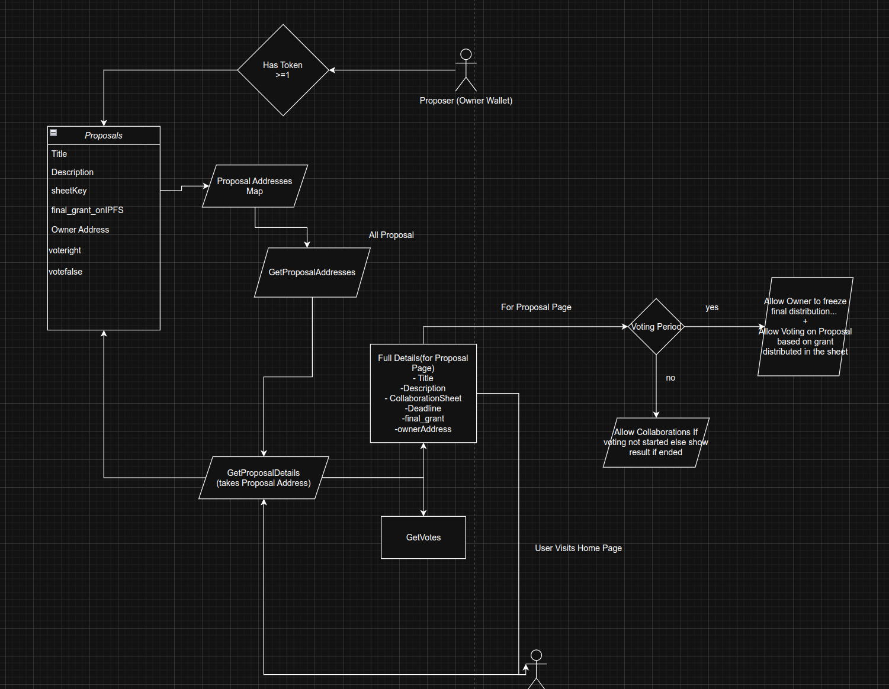

# 🧾 EtherCalc-Proposal-Voting-PoC

Welcome to the **EtherCalc + Web3 Voting PoC**!  
This project demonstrates how collaborative spreadsheets (EtherCalc) and on-chain voting can work together for decentralized decision-making, grant tracking, and more.

---

## 🚀 Quick Start

### 1. ⚡️ Clone & Install

```bash
git clone https://github.com/anisharma07/EtherCalc-Proposal-Voting-PoC.git
cd EtherCalc-Proposal-Voting-PoC
npm install
```

### 2. 🛠️ Environment Setup

- Copy `.env` from the repo or create your own:
  - Add your Infura, Pinata, and WalletConnect keys.
  - Example:
    ```
    VITE_CLOUD_CONNECT_PROJECT_ID=...
    ```

### 3. 🧑‍💻 Run the App

```bash
ionic serve
```

- Open [http://localhost:5173](http://localhost:5173) in your browser.

---

## 🏗️ Project Structure

- **Ionic + React** frontend (`src/`)
- **Deployed Contracts** (see [`src/contracts.ts`](src/contracts.ts)):
  - `ProposalFactory`: Deploys new voting proposals.
  - `Proposal`: Each proposal is a contract with voting logic.
  - `MediToken`: (from ZKMedical-Billing) for token-gated features.

---

## 🔗 Web3 Integration

- **Wallet Connection**: [RainbowKit](https://rainbowkit.com/) + [Wagmi](https://wagmi.sh/)
- **Contract Read/Write**: Wagmi hooks for proposals, voting, and token balance.
- **Off-chain Signing**: Supported via WalletConnect.

---

## 📊 EtherCalc Integration

- Each proposal links to a unique EtherCalc sheet (iframe embed).
- Sheet key is generated and stored on-chain with the proposal.
- **Use Cases**:
  - Collaborative grant scoring
  - Distributed data entry
  - Real-time updates visible to all voters

---

## 🗳️ Voting Flow

1. **Create Proposal**:

   - Fill title, description, and generate a new EtherCalc sheet.
   - Set voting start/end times.
   - Proposal is deployed on-chain with sheet key.

2. **Collaborate**:

   - Anyone can edit the EtherCalc sheet (unless frozen).

3. **Vote**:

   - Connect wallet, vote for/against.
   - Votes are recorded on-chain.

4. **Freeze Sheet**:
   - Proposal owner can freeze the sheet (lock further edits) once voting starts.

---

## 🧩 How This PoC Was Built

- **Approach**:

  - Started from the ZKMedical-Billing modules for token and contract patterns.
  - Built a new frontend with Ionic + React for mobile/web UX.
  - Used EtherCalc for collaborative, off-chain data.
  - Linked EtherCalc sheet keys to proposals on-chain for traceability.

- **Web3 Tools/Libraries**:

  - [Wagmi](https://wagmi.sh/) for contract interaction
  - [RainbowKit](https://rainbowkit.com/) for wallet UI
  - [Viem](https://viem.sh/) for EVM utilities
  - [Pinata](https://pinata.cloud/) for optional IPFS storage

- **EtherCalc**:

  - Used as a collaborative spreadsheet for each proposal.
  - Sheet key is stored in the proposal contract.
  - Embedded via iframe for real-time collaboration.

- **Relevant Experience**:
  - Prior work with token-gated dApps, DAO tooling, and on-chain voting.
  - Experience integrating off-chain collaborative tools (like Google Sheets, EtherCalc) with smart contracts.

---

## 🖼️Proposals Flow:



---

## 🖼️ Screenshots & Demo

> Challenge Module Setup Screenshots: [link](https://drive.google.com/drive/folders/1h_TM8jj-ufg-78bkWjGKfS2Ye0khIar3?usp=drive_link)
> EtherCalc PoC App ScreenShots: [link](https://drive.google.com/drive/folders/1sKv1Pmv7O7zLm8XTdXkL_JDk-uBaDKBQ?usp=drive_link)
> Live Hosted link for EtherCalc: [vercel link](https://ether-calc-proposal-voting-po-c.vercel.app/home)
> Demo Walkthrough: [video link](https://drive.google.com/file/d/181NxNKuqtQGAOCEqRugnebJde5aYwgEn/view?usp=drive_link)
> My Experience in web 3.0 and programming: [link](https://docs.google.com/document/d/1GacsJVS_Q8gGFMu11tZDesi80rVFSZ8PQVGjR72rjeo/edit?usp=sharing)

---

## 📚 References

- [ZKMedical-Billing Modules](https://github.com/seetadev/ZKMedical-Billing)
- [EtherCalc](https://ethercalc.net/)
- [RainbowKit](https://rainbowkit.com/)
- [Wagmi](https://wagmi.sh/)

---

Thank You! 🚀
